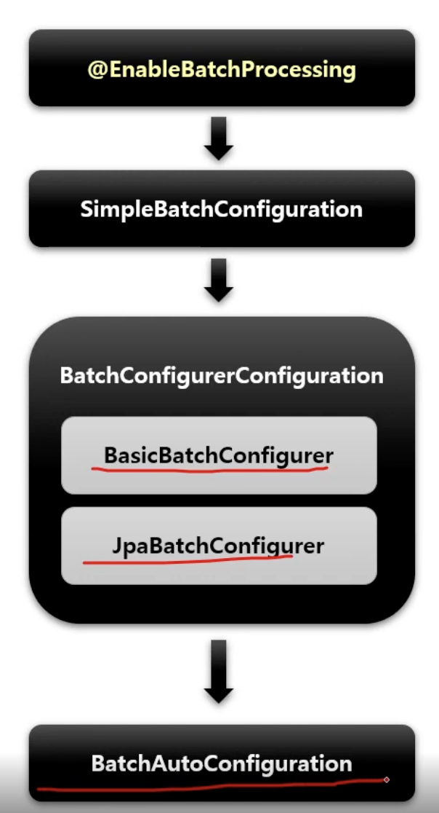
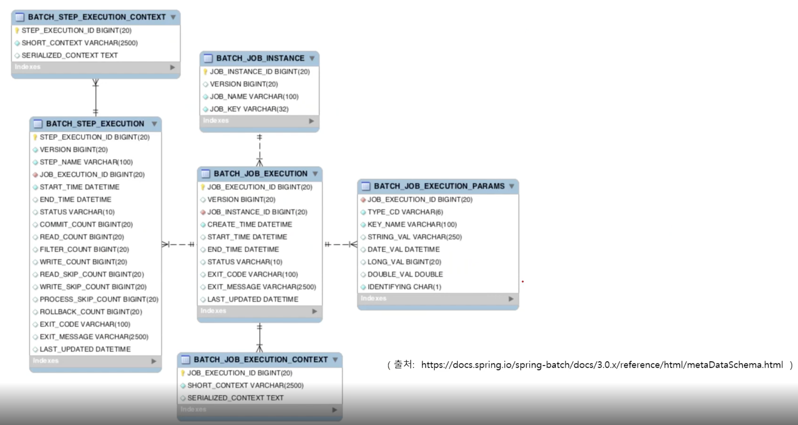

# Spring Batch
### 의존성 추가
```
implementation 'org.springframework.boot:spring-boot-starter-batch'
```
### 활성화 시키기
- ```@EnableBatchProcessing``` 애노테이션 추가
- 총 4개의 설정 클래스를 실행시키며 스프링 배치의 모든 초기화 및 실행 구성이 이루어진다.
  - BatchAutoConfiguration
    - 스프링배치가 초기화될 때 자동으로 실행되는 설정 클래스
    - Job을 수행하는 JobLauncherApplicationRunner 빈을 생성
  - SimpleBatchConfiguration
    - JobBuilderFactory 와 StepBuilderFactory 생성
    - 스프링 배치의 주요 구성 요소 생성 - 프록시 객체로 생성됨
  - BatchConfigurerConfiguration
    - BasicBatchConfigurer
      - SimpleBatchConfiguration 에서 생성한 프록시 객체의 실제 대상 객체를 생성하는 설정 클래스
      - 빈으로 의존성 주입을 받아서 주요 객체들을 참조해서 사용할 수 있다.
    - JpaBatchConfigurer
      - Jpa 관련 객체를 생성하는 설정 클래스
    - 사용자 정의 BatchConfigurer 인터페이스를 구현하여 사용할 수 있음       
    
- 스프링 부트 배치의 자동 설정 클래스가 실행됨으로 빈으로 등록된 모든 Job을 검색해서 초기화와 동시에 Job을 수행하도록 구성됨

### 시작하기
- ```@Configuration``` 선언 : 하나의 배치 Job 을 정의하고 빈 설정
- JobBuilderFactory : Job 을 생성하는 빌더 팩토리
- StepBuilderFactory : Step 을 생성하는 빌더 팩토리
- Job : 전체 일, 일감
- Step : Job 안에서의 단계
- Tasklet : Step 안에서 단일 태스크로 수행되는 로직 구현
- Job 구동 > Step 실행 > Tasklet 실행

### DB 스키마 설정
- 메타 데이터를 저장하는 6개의 테이블이 존재     
  
  - Job 관련 테이블
    - BATCH_JOB_INSTANCE : Job 이 실행될 때 Job Instance 정보 저장 (job_name, job_key 를 하나의 키로 사용)
    - BATCH_JOB_EXECUTION : Job 의 실행 정보가 저장 (생성, 시작, 종료 시간, 실행 상태, 메시지 등)
    - BATCH_JOB_EXECUTION_PARAMS : Job 과 함께 실행되는 JobParameter 저장
    - BATCH_JOB_EXECUTION_CONTEXT : Job 의 실행동안 여러가지 상태 정보, 공유 데이터를 직렬화하여 저장 (Step 끼리 공유)
  - Step 관련 테이블
    - BATCH_STEP_EXECUTION : Step 의 실행 정보가 저장
    - BATCH_STEP_EXECUTION_CONTEXT : Step 의 실행동안 여러가지 상태 정보, 공유 데이터를 직렬화하여 저장 (Step 별 저장, 공유 x)
- 자동 생성을 위해 ```application.yml``` 파일에 설정이 필요
  ```yaml
  spring:
    batch:
      jdbc:
        initialize-schema: always
  ```
- 운영에서는 naver로 설정하고 직접 db에 테이블 생성 쿼리를 날릴 수 있도록 해야 함.
  - 기본 데이블 생성 쿼리는 ```spring-batch-core``` 내부에 포함되어 있음.

### 참고
- [인프런 강의](https://www.inflearn.com/course/%EC%8A%A4%ED%94%84%EB%A7%81-%EB%B0%B0%EC%B9%98/dashboard)